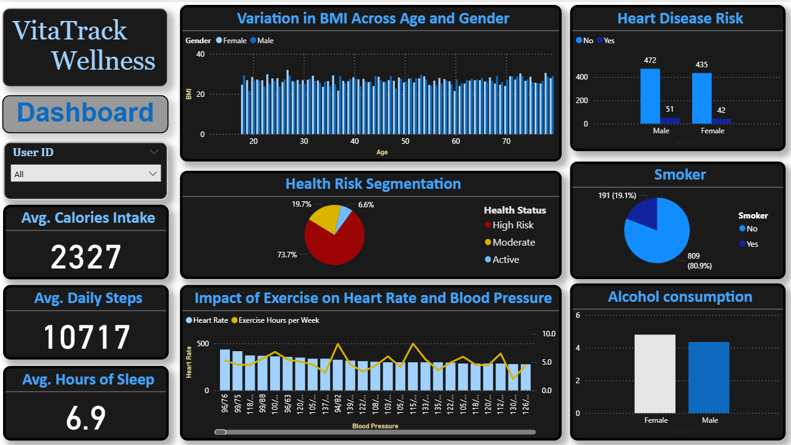

VitaTrack Wellness – Power BI Health Insights Dashboard

📊 Project Overview
This project is an interactive Power BI dashboard built for VitaTrack Wellness, a fictional health & wellness platform. It analyzes user lifestyle and biometric data to deliver insights into health risks, behaviors, and wellness trends.

The main goal of this dashboard is to present clear, actionable health insights that can support decision-making for users or wellness professionals.

📌 Key Insights Covered
🧍 BMI variation by age and gender

❤️ Heart disease risk comparison (Male vs Female)

🧠 Health segmentation: High Risk, Moderate, Active

🏃‍♂️ Exercise impact on heart rate and blood pressure

💤 Lifestyle metrics: average sleep, calorie intake, steps

🚬 Smoking and 🍷 alcohol consumption patterns

🛠️ Tools & Skills Used
Power BI

DAX (calculated columns & measures)

Data Modeling (relationships, transformations)

Custom Visuals & Slicers for interactivity

Data Storytelling with KPIs and segmentation

📷 Dashboard Preview

Complete view of the VitaTrack Wellness Dashboard

📂 Files Included
VitaTrack_Wellness.pbix – Power BI dashboard file

README.md – Project documentation

screenshots/ – Dashboard visuals (optional)

🚀 How to Use
Download or clone this repository

Open VitaTrack_Wellness.pbix in Power BI Desktop

Explore visualizations, slicers, and insights

Customize or connect your own health dataset if desired

🧠 Learning Outcome
This project helped me strengthen my skills in:

Designing user-friendly dashboards

Applying analytical thinking to health-related data

Creating clean and focused visual narratives

🔗 Connect With Me
I’m currently looking for data analyst internships and entry-level opportunities.

📧 Email: your-email@example.com
💼 LinkedIn: linkedin.com/in/mohit-singh-adhikari
📊 More Projects: GitHub Portfolio

📎 Tags
Power BI Data Analytics Healthcare Dashboard Portfolio Project Wellness Analytics DAX Visualization
